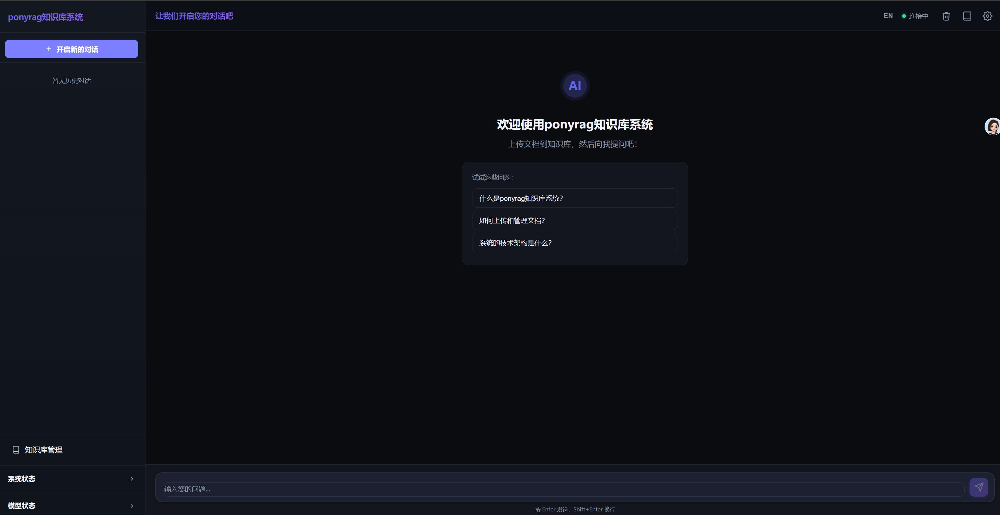
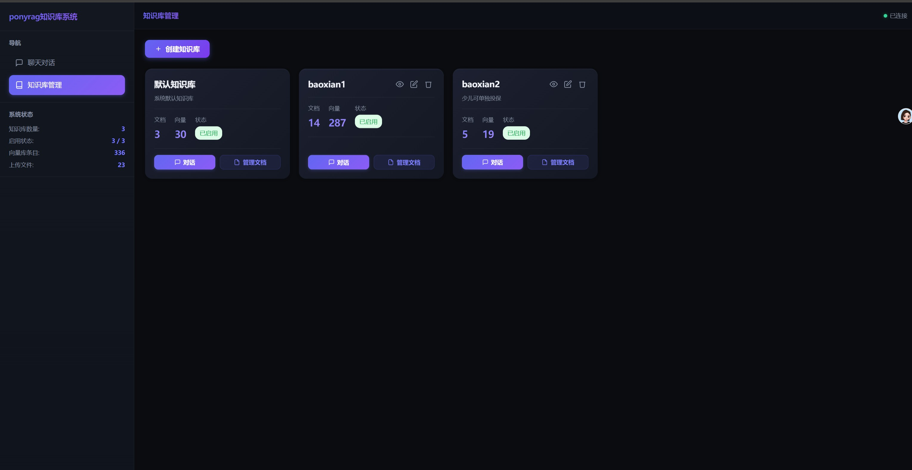
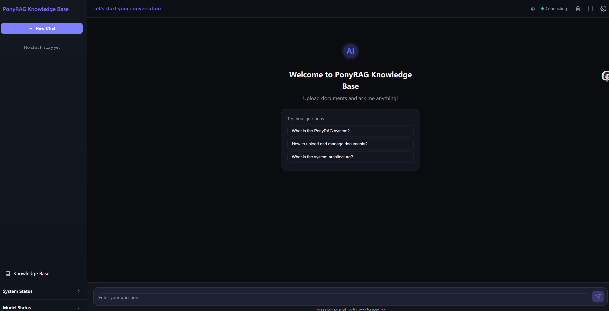
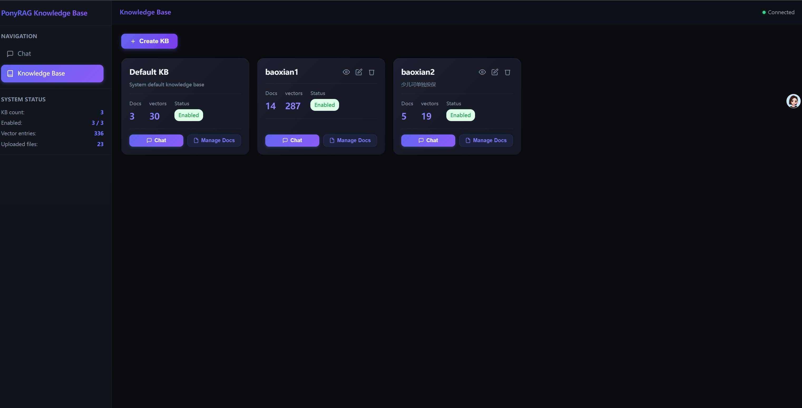

# PonyRAG 知识库系统

<div align="center">

**PonyRAG Knowledge Base System**

*🐴 A lightweight, production-ready RAG knowledge base system powered by LangChain, Ollama, and ChromaDB*

[中文](#中文文档) | [English](#english-documentation)

[](https://www.python.org/)
[](https://fastapi.tiangolo.com/)
[](https://www.trychroma.com/)
[](https://ollama.com/)
[](LICENSE)

</div>

---

<div id="中文文档"></div>

## 🖼️ 界面预览

<div align="center">


</div>

---

## 📖 项目简介

**PonyRAG** 是一个基于 RAG（检索增强生成）技术的本地知识库问答系统，专为企业和个人知识管理场景设计。系统完全本地部署，保护数据隐私，支持多种文档格式，提供智能问答和知识检索服务。

### ✨ 核心特性

- 🚀 **开箱即用** — 本地部署，无需云服务，保护数据隐私
- 📚 **多格式支持** — PDF、Word、Excel、PowerPoint、Markdown、TXT 自动解析
- 🧠 **智能检索** — 向量检索 + Rerank 精排（CrossEncoder/Listwise/Ollama 三模式可选）+ 标题树章节扩展，确保答案准确性
- 💬 **多轮对话** — 支持上下文记忆的连续对话
- 🗂️ **多会话管理** — 侧边栏会话列表，按日期分组，支持新建、切换、重命名、删除会话
- 🗄️ **多知识库管理** — 创建、启用/禁用多个独立知识库
- 🎨 **现代界面** — 响应式 Web UI，支持移动端和桌面端，Markdown 表格渲染
- ⚡ **高性能** — ChromaDB 向量存储，毫秒级检索响应
- 🔄 **模型热切换** — 在线更换 LLM/Embedding/Rerank 模型
- 🌊 **流式输出** — 默认开启，逐 token 实时渲染
- 🤔 **Thinking 模式** — 支持开启/关闭模型思考模式，适配 qwen3 等推理模型

### 🏗️ 技术架构

```
用户交互
  ↓
┌─────────────────────────────────────────┐
│  前端 (Vanilla JavaScript)              │
│  - 聊天界面 (index.html)                │
│  - 知识库管理 (knowledge.html)          │
└───────────────┬─────────────────────────┘
                │ REST API
┌───────────────▼─────────────────────────┐
│  后端 (FastAPI + Python)                │
│  ┌─────────────────────────────────┐    │
│  │  RAG Engine (rag_engine.py)    │    │
│  │  - 向量检索                      │    │
│  │  - Rerank 精排                   │    │
│  │  - LLM 生成回答                  │    │
│  └─────────────────────────────────┘    │
│  ┌─────────────────────────────────┐    │
│  │  文档处理 (document_processor)  │    │
│  │  - Markitdown 解析              │    │
│  │  - 文本分块                      │    │
│  └─────────────────────────────────┘    │
│  ┌─────────────────────────────────┐    │
│  │  知识库管理 (knowledge_base)    │    │
│  │  - 多知识库元数据管理            │    │
│  │  - SQLite 存储                   │    │
│  └─────────────────────────────────┘    │
└───────────────┬─────────────────────────┘
                │
┌───────────────▼─────────────────────────┐
│  ChromaDB (向量数据库)                  │
│  - 每个知识库独立 Collection            │
│  - 本地持久化存储                        │
└─────────────────────────────────────────┘
                │
┌───────────────▼─────────────────────────┐
│  Ollama (本地大模型推理)                │
│  - 对话模型 (Chat Model)                │
│  - 嵌入模型 (Embedding Model)           │
│  - Rerank 模型 (可选, Ollama 模式)       │
└─────────────────────────────────────────┘
                │
┌───────────────▼─────────────────────────┐
│  CrossEncoder (本地 HuggingFace 推理)   │
│  - BAAI/bge-reranker-v2-m3 等模型       │
│  - GPU 加速，约 0.1s/6 doc              │
│  - 默认 Rerank 方式（精度最高）          │
└─────────────────────────────────────────┘
```

**技术栈：**
- **后端**: FastAPI + LangChain + Python 3.11+
- **向量数据库**: ChromaDB (本地持久化)
- **大语言模型**: Ollama (支持 Qwen、Llama 等开源模型)
- **文档解析**: Markitdown (支持多种文档格式)
- **Rerank 精排**: sentence-transformers CrossEncoder（本地 GPU，默认）/ Ollama / Listwise
- **前端**: Vanilla JavaScript + Marked.js
- **数据存储**: SQLite (聊天历史 + 知识库元数据)

### 🎯 主要功能

#### 1. 知识库管理
- ✅ 创建/编辑/删除知识库
- ✅ 启用/禁用知识库
- ✅ 查看文档数和向量数统计
- ✅ 每个知识库独立的向量空间

#### 2. 文档管理
- ✅ 拖拽上传或点击上传
- ✅ 自动格式转换（PDF/Word → Markdown）
- ✅ 批量删除文档
- ✅ 实时索引进度显示
- ✅ 支持格式：PDF、DOCX、XLSX、PPTX、TXT、MD
- ✅ **索引状态持久化** — 上传成功/失败状态写入数据库，重新打开弹窗后状态仍然正确显示
- ✅ **失败原因 Tooltip** — 鼠标悬停在「失败」标签上可查看具体失败原因
- ✅ **列排序** — 点击「文件名」「切分类型」「上传时间」「状态」列头即可排序，支持升降序切换
- ✅ **文件搜索** — 工具栏右侧搜索框，实时过滤文件名，无匹配时显示提示
- ✅ **一屏显示** — 文档管理弹窗固定高度，内容在框内滚动，不产生页面级滚动条

#### 3. 智能问答
- ✅ 基于知识库的精准回答
- ✅ 显示参考来源和相关度评分
- ✅ 选择特定知识库或全库检索
- ✅ Markdown 格式渲染（代码高亮、表格等）
- ✅ 多轮对话上下文记忆
- ✅ **流式输出** — 逐 token 实时渲染，告别等待
- ✅ **停止生成** — 点击停止按钮立即中断 Ollama 推理，释放 GPU，无需等待任务结束
- ✅ **Token 用量显示** — 每条回答底部显示输入 / 输出 / 合计 tokens

#### 3.1 多会话管理
- ✅ **侧边栏会话列表** — 历史对话按「今天 / 7天内 / 30天内 / 更早」自动分组展示
- ✅ **新建对话** — 点击「开启新的对话」按钮随时开启全新会话
- ✅ **一键切换** — 点击任意历史会话即刻加载对应消息记录
- ✅ **重命名会话** — 悬停显示操作按钮，支持自定义会话标题（最长 50 字）
- ✅ **删除会话** — 单条删除，删除当前会话后自动跳转到最近一条或新建
- ✅ **持久化存储** — 每条会话独立存储在 SQLite，重启后完整恢复
- ✅ **中英双语** — 会话列表及所有操作文字均支持中 / 英切换

#### 4. 模型管理
- ✅ 在线切换对话模型
- ✅ 在线切换 Embedding 模型（自动重建索引）
- ✅ 在线切换 OCR 视觉模型（用于图片型 PDF / 扫描件）**，切换后立即生效，无需重启**
- ✅ 调整检索参数（TOP-K、Rerank-TOP-K 等）
- ✅ 调整上下文窗口大小（num_ctx），单位 K，默认 128K
- ✅ 调整参考知识字符数（context_limit），单位 K，默认 20K
- ✅ 开启/关闭模型思考模式（thinking），适配 qwen3 等推理模型
- ✅ 实时显示模型加载状态

#### 5. 文档切分方式

上传文档时可为每个文档单独选择切分方式，也可在参数设置中配置全局默认值：

| 切分方式 | 原理 | 适合场景 |
|---------|------|---------|
| 🤖 **自动检测** | 上传时由 LLM 分析文档结构，自动推荐最合适的切分方式 | 不确定时首选，节省手动判断 |
| ✂️ **固定切分** | 严格按字符数截断，不考虑语义边界 | 格式混乱的纯文本、日志、数据导出 |
| 🔀 **递归切分**（默认） | 优先按标点/空行逐级细分，兼顾语义与均匀性 | 通用文档，不确定时首选 |
| 📑 **标题树切分** | 按 `#/##/###` 标题层级切，块内含章节路径上下文 | 结构化文档（保险条款、产品手册、API 文档） |
| 🧠 **语义切分** | 用 Embedding 相似度判断段落边界，块大小不固定（较慢） | 叙事型文档（新闻、报告、书籍） |

每个文档的切分参数（方式、大小、重叠）独立存储在 SQLite 数据库中，重建向量库时自动沿用原参数。

#### 6. PDF 智能转换（pdfplumber）

上传 PDF 文件时，系统自动使用 **pdfplumber** 精确提取表格，解决原始 PDF 中多列跨行、合并单元格被错位提取的问题：

- **合并单元格自动展开**：跨行单元格的值正确填充到每一行，不再错位
- **表格与正文分离提取**：表格区域精确识别，非表格文字段落、标题单独提取后合并
- **速度快**：纯本地计算，不调用 LLM，秒级完成（原 OCR 方式需 60-130 秒）
- **降级保护**：若 pdfplumber 不可用，自动回退到 markitdown 普通转换

#### 7. 前端 Markdown 表格渲染

AI 回答中的 Markdown 表格（`| 列1 | 列2 |` 格式）会自动渲染为带样式的 HTML 表格，支持：
- 表头紫色高亮、隔行着色、hover 效果
- 横向滚动（适配长表格）
- 表格内 `<br>` 换行正常显示

#### 8. 通用设置
- ✅ **主题切换** — 浅色 / 深色两种主题，设置后即时生效并跨页面持久保存
- ✅ **流式输出开关** — 可随时切换逐字流式输出或等待完整答案一次性显示，**默认开启**
- ✅ **双语界面** — 支持中文 / English 切换，点击顶栏 `EN`/`中` 按钮或在通用设置中选择，即时生效无需刷新

#### 6. 智能召回增强（标题树切分专属）

当知识库使用标题树切分时，系统会自动识别被召回 chunk 所属的章节标题，并将该章节的所有 chunk 一并送入 LLM，确保列举型问题（「有哪些」「清单」等）能完整回答，而不是只返回部分条目。

### 📦 快速开始

#### 前置要求

- **Python 3.11+**
- **Ollama** ([安装指南](https://ollama.com/))
- **推荐配置**: 16GB+ 内存，NVIDIA GPU（可选）

#### 安装步骤

**1. 克隆项目**
```bash
git clone https://github.com/kimikang/ponyrag.git
cd ponyrag
```

**2. 安装依赖**
```bash
cd backend
pip install -r requirements.txt
pip install markitdown
```

**2.1 安装 CrossEncoder Rerank 依赖**（默认 Rerank 方式，推荐）
```bash
# CPU 推理（无 GPU 时自动回退）
pip install sentence-transformers torch

# GPU 加速（推荐，RTX 3090 约 0.1s/6 doc）
pip install sentence-transformers
pip install torch --index-url https://download.pytorch.org/whl/cu124
```

首次运行时系统自动从 HuggingFace 下载 `BAAI/bge-reranker-v2-m3`（约 1.1GB）。
如需离线使用，提前下载后在 `.env` 设置 `HF_HUB_OFFLINE=1`。

**2.2 可选：安装 OCR 支持**（用于图片型 PDF / 扫描件文字提取）
```bash
pip install markitdown-ocr openai
```

**3. 安装 Ollama 并下载模型**

访问 [https://ollama.com](https://ollama.com) 下载并安装 Ollama

下载推荐模型（约 15GB）：
```bash
# 对话模型
ollama pull qwen3.6:27b

# 嵌入模型
ollama pull qwen3-embedding:4b

# Rerank 模型
ollama pull qllama/bge-reranker-v2-m3:f16

# OCR 视觉模型（可选，用于图片型 PDF / 扫描件）
ollama pull qwen2.5vl:7b
```

**4. 启动服务**

**Windows:**
```bash
start.bat
```

**Windows (Conda):**
```bash
"start for conda.bat"
```

**Linux/macOS:**
```bash
chmod +x start.sh
./start.sh
```

**5. 访问应用**

浏览器会自动打开 [http://localhost:8001](http://localhost:8001)

### 📝 使用说明

#### 创建知识库并上传文档

1. 点击顶部导航「知识库管理」
2. 点击「创建知识库」按钮，填写名称和描述
3. 在知识库卡片上点击「管理文档」
4. 拖拽或点击上传 PDF/Word/Excel 等文件
5. 等待文档自动解析和索引完成

#### 开始提问

1. 返回主页（聊天界面）
2. 在左侧「检索知识库」下拉框选择知识库（或选择「所有已启用的知识库」）
3. 在输入框输入问题，按 Enter 发送
4. AI 会基于知识库内容生成回答，并显示参考来源

#### 模型和参数设置

点击右上角 ⚙️ 图标打开设置面板：

- **模型设置**：切换 Chat/Embed/Rerank/OCR 模型
- **参数设置**：调整 TOP-K、Rerank-TOP-K、分块大小等
- **通用设置**：
  - 🎨 **主题切换** — 点击「☀️ 浅色」或「🌙 深色」卡片即时切换界面主题，无需保存，刷新后保持
  - ⚡ **流式输出** — 开启后 AI 回答逐字实时渲染；关闭则等待完整答案后一次性显示（默认关闭）

### ⚙️ 配置说明

编辑 `backend/.env` 文件自定义配置：

```env
# Ollama 服务地址
OLLAMA_BASE_URL=http://localhost:11434

# 模型配置
CHAT_MODEL=qwen3.6:27b                      # 对话模型
EMBED_MODEL=qwen3-embedding:4b               # 嵌入模型
RERANK_MODEL=qllama/bge-reranker-v2-m3:f16  # Rerank 模型（RERANK_METHOD=ollama 时生效）
OCR_MODEL=qwen2.5vl:7b                      # OCR 视觉模型（留空禁用）

# Rerank 方式（重要）
# cross_encoder — 本地 HuggingFace CrossEncoder（默认，精度最高，GPU 约 0.1s）
# ollama        — 通过 Ollama 推理（embed 或 generate+logprob，自动判断）
# listwise      — 用 CHAT_MODEL 批量排序（精度高但大模型速度较慢）
# none          — 禁用 rerank，仅按向量相似度排序
RERANK_METHOD=cross_encoder

# CrossEncoder 本地模型（RERANK_METHOD=cross_encoder 时生效）
# 首次使用自动下载，约 1.1GB
CROSS_ENCODER_MODEL=BAAI/bge-reranker-v2-m3

# HuggingFace 离线模式（模型已下载后建议开启，消除联网警告）
HF_HUB_OFFLINE=1

# RAG 参数
TOP_K=6                # 向量检索召回数量
RERANK_TOP_K=4         # Rerank 精排后保留数量
CHUNK_SIZE=500         # 文档分块大小（token）
CHUNK_OVERLAP=50       # 分块重叠大小（token）
CHUNK_METHOD=recursive # 切分方式：recursive | markdown | semantic | fixed
CONTEXT_LIMIT=20000    # 送入 LLM 的最大参考知识字符数
THINKING=false         # 模型思考模式（false 关闭，适配 qwen3 等推理模型）

# 服务配置
HOST=0.0.0.0
PORT=8001
```

### � 项目结构

```
ponyrag/
├── backend/                    # 后端服务
│   ├── app.py                 # FastAPI 主应用
│   ├── rag_engine.py          # RAG 核心引擎
│   ├── vector_store.py        # 向量数据库管理
│   ├── document_processor.py  # 文档处理模块
│   ├── knowledge_base.py      # 知识库管理
│   ├── chat_history.py        # 聊天历史存储
│   ├── config.py              # 配置管理
│   ├── requirements.txt       # Python 依赖
│   ├── .env                   # 环境配置
│   ├── uploads/               # 文档上传目录
│   └── vector_db/             # ChromaDB 数据目录
├── frontend/                   # 前端界面
│   ├── index.html             # 聊天界面
│   ├── knowledge.html         # 知识库管理界面
│   ├── app.js                 # 聊天页面逻辑
│   ├── knowledge.js           # 知识库管理逻辑
│   └── style.css              # 全局样式
├── start.bat                   # Windows 启动脚本
├── start for conda.bat         # Conda 环境启动脚本
├── start.sh                    # Linux/macOS 启动脚本
└── README.md                   # 项目文档
```

### 🔌 API 文档

启动服务后访问 [http://localhost:8001/docs](http://localhost:8001/docs) 查看完整的 Swagger API 文档。

主要接口：

| 方法 | 路径 | 说明 |
|------|------|------|
| `POST` | `/api/chat` | 发送问题并获取回答 |
| `GET` | `/api/knowledge-bases` | 获取知识库列表 |
| `POST` | `/api/knowledge-bases` | 创建新知识库 |
| `PUT` | `/api/knowledge-bases/{kb_id}` | 更新知识库信息 |
| `DELETE` | `/api/knowledge-bases/{kb_id}` | 删除知识库 |
| `POST` | `/api/upload` | 上传文档 |
| `GET` | `/api/documents` | 获取文档列表 |
| `DELETE` | `/api/documents/{filename}` | 删除文档 |
| `GET` | `/api/stats` | 获取统计信息 |
| `GET` | `/api/model-status` | 获取模型加载状态 |
| `POST` | `/api/config/models` | 切换模型配置 |
| `GET` | `/api/sessions` | 获取所有会话列表 |
| `GET` | `/api/sessions/{id}/messages` | 获取指定会话的消息记录 |
| `DELETE` | `/api/sessions/{id}` | 删除指定会话 |
| `PUT` | `/api/sessions/{id}/title` | 重命名会话标题 |

### 🛠️ 常见问题

**Q: 启动后模型一直显示「加载中」？**

Ollama 首次加载大模型需要时间（30秒-几分钟），请耐心等待。可在 Ollama 终端查看加载进度。侧边栏每个模型旁有刷新按钮，超时后可手动重试。

**Q: 提问返回「知识库中暂无相关内容」？**

- 确认知识库已上传文档且向量库条目数 > 0
- 检查知识库是否已启用
- 若刚切换 Embedding 模型，等待重新索引完成

**Q: 如何处理图片型 PDF / 扫描件？**

1. 安装 OCR 依赖：`pip install markitdown-ocr openai`
2. 在 Ollama 中拉取支持视觉输入的模型，如 `ollama pull qwen2.5vl:7b`
3. 在前端设置页面「OCR 模型」下拉框选择该模型并保存
4. 再次上传 PDF，系统会自动识别图片文字

**Q: 如何提升检索速度？**

1. 降低 TOP_K 和 RERANK_TOP_K 参数
2. 使用更小的模型（如 qwen2.5:7b）
3. 使用 GPU 运行 Ollama

**Q: 支持哪些文档格式？**

目前支持：PDF、DOCX、XLSX、PPTX、TXT、MD

**Q: 切换 Embedding 模型后提示维度不匹配？**

不同模型输出维度不同。系统会自动检测并清空旧向量库，重启后自动重新索引。⚠️ 建议不要频繁切换 Embedding 模型。

### ⚡ 性能优化建议

#### 🖥️ 推荐硬件配置

根据 GPU 显存选择合适的模型组合：

| 显存 | 代表显卡 | Chat 模型 | Embedding 模型 | Rerank 模型 | 适用场景 |
|------|---------|-----------|---------------|------------|---------|
| **32GB** | RTX 5090 | `qwen3.6:27b` / `qwen3.8:27b` | `qwen3-embedding:8b` | `BAAI/bge-reranker-v2-m3` | 生产环境，最佳精度 |
| **24GB** | RTX 4090 / 3090 | `qwen3.5:9b` | `qwen3-embedding:8b` | `BAAI/bge-reranker-v2-m3` | 高性能，平衡精度与速度 |
| **16GB** | RTX 5080 / 5070 Ti | `qwen3.5:9b` | `qwen3-embedding:4b` | `BAAI/bge-reranker-v2-m3` | 个人使用，流畅运行 |

> 💡 **说明：**
> - `qwen3-embedding:8b` 向量维度 4096，检索精度更高，但首次加载较慢
> - `qwen3-embedding:4b` 向量维度 2560，速度与精度平衡，16GB 显存推荐选项
> - Rerank 模型 `BAAI/bge-reranker-v2-m3` 约 567M，所有显存配置均可运行
> - Chat 模型和 Embedding 模型同时驻留显存，请确保显存留有余量

**TOP_K 参数调优：**
- 准确度优先：`TOP_K=10, RERANK_TOP_K=6`
- 平衡（推荐）：`TOP_K=6, RERANK_TOP_K=4`
- 速度优先：`TOP_K=3, RERANK_TOP_K=2`

### 🚧 开发路线

- [x] 多知识库管理
- [x] 文档上传与自动解析
- [x] 向量检索 + Rerank
- [x] 多轮对话历史
- [x] **多会话管理** — 侧边栏会话列表，新建/切换/重命名/删除，按日期分组
- [x] 模型热切换
- [x] 参数动态调整（TOP-K、num_ctx、context_limit 等）
- [x] 图片型 PDF OCR 支持（基于 Ollama 视觉模型）
- [x] 流式输出（SSE 逐 token 实时渲染，默认开启）
- [x] 停止生成（前端点击停止后立即中断 Ollama 推理，释放 GPU）
- [x] 深色 / 浅色主题切换
- [x] 标题树切分 + 章节完整召回（列举型问题优化）
- [x] Thinking 模式参数化（适配 qwen3 等推理模型）
- [x] 前端 Markdown 表格渲染
- [x] 切分参数独立设置（每个文档可单独配置）
- [x] Token 用量展示（输入 / 输出 / 合计，每条回答底部显示）
- [x] 文档索引状态持久化（成功/失败写入数据库，失败原因可悬停查看）
- [x] 文档列表列排序（文件名、切分类型、上传时间、状态支持点击排序）
- [x] 文档列表搜索框（实时过滤文件名）
- [x] OCR 模型前端修改立即生效（无需重启后端）
- [x] **Rerank 多模式支持** — CrossEncoder（本地 GPU，默认）/ Listwise / Ollama / none 可在 `.env` 配置切换
- [x] **CrossEncoder GPU 加速** — BAAI/bge-reranker-v2-m3，RTX 3090 约 0.1s/6doc，Top-1 准确率 5/5
- [ ] 文档在线预览
- [ ] 导出聊天记录
- [ ] 多用户权限管理
- [ ] Docker 一键部署
- [ ] 知识库版本管理

### 🤝 贡献指南

欢迎提交 Issue 和 Pull Request！

1. Fork 本仓库
2. 创建特性分支 (`git checkout -b feature/AmazingFeature`)
3. 提交更改 (`git commit -m 'Add some AmazingFeature'`)
4. 推送到分支 (`git push origin feature/AmazingFeature`)
5. 开启 Pull Request

### 📄 开源协议

本项目采用 [Apache License 2.0](LICENSE) 开源协议。

### 👨‍💻 作者

**kimikang**

📧 86941737@qq.com

---

<div id="english-documentation"></div>

## 🖼️ Screenshots

<div align="center">


</div>

---

## 📖 About

**PonyRAG** is a local knowledge base Q&A system based on RAG (Retrieval-Augmented Generation) technology, designed for enterprise and personal knowledge management scenarios. The system is fully deployed locally, protects data privacy, supports multiple document formats, and provides intelligent Q&A and knowledge retrieval services.

### ✨ Key Features

- 🚀 **Ready to Use** — Local deployment, no cloud services required, data privacy protected
- 📚 **Multi-format Support** — Auto-parsing for PDF, Word, Excel, PowerPoint, Markdown, TXT
- 🧠 **Smart Retrieval** — Vector search + Rerank (CrossEncoder/Listwise/Ollama modes) + header-tree section expansion for accurate answers
- 💬 **Multi-turn Dialogue** — Context-aware conversations with memory
- 🗂️ **Multi-session Management** — Sidebar session list with date grouping; create, switch, rename, and delete sessions
- 🗄️ **Multiple Knowledge Bases** — Create, enable/disable multiple independent knowledge bases
- 🎨 **Modern UI** — Responsive web interface supporting mobile and desktop, Markdown table rendering
- ⚡ **High Performance** — ChromaDB vector storage with millisecond-level retrieval
- 🔄 **Hot Model Swapping** — Switch LLM/Embedding/Rerank/OCR models on-the-fly
- 🌊 **Streaming Output** — Enabled by default, real-time token-by-token rendering via SSE
- 🛑 **Stop Generation** — Click stop to immediately abort Ollama inference and free GPU
- 📊 **Token Usage Display** — Shows input / output / total tokens at the bottom of each response
- 🤔 **Thinking Mode** — Toggle model reasoning mode, compatible with qwen3 and other reasoning models

### 🏗️ Architecture

```
User Interaction
  ↓
┌─────────────────────────────────────────┐
│  Frontend (Vanilla JavaScript)          │
│  - Chat interface (index.html)          │
│  - Knowledge base mgmt (knowledge.html) │
└───────────────┬─────────────────────────┘
                │ REST API
┌───────────────▼─────────────────────────┐
│  Backend (FastAPI + Python)             │
│  ┌─────────────────────────────────┐    │
│  │  RAG Engine (rag_engine.py)    │    │
│  │  - Vector retrieval             │    │
│  │  - Rerank scoring               │    │
│  │  - LLM answer generation        │    │
│  └─────────────────────────────────┘    │
│  ┌─────────────────────────────────┐    │
│  │  Document Processor             │    │
│  │  - Markitdown parsing           │    │
│  │  - Text chunking                │    │
│  └─────────────────────────────────┘    │
│  ┌─────────────────────────────────┐    │
│  │  Knowledge Base Manager         │    │
│  │  - Multi-KB metadata            │    │
│  │  - SQLite storage               │    │
│  └─────────────────────────────────┘    │
└───────────────┬─────────────────────────┘
                │
┌───────────────▼─────────────────────────┐
│  ChromaDB (Vector Database)             │
│  - Independent collection per KB        │
│  - Local persistent storage             │
└─────────────────────────────────────────┘
                │
┌───────────────▼─────────────────────────┐
│  Ollama (Local LLM Inference)           │
│  - Chat model                           │
│  - Embedding model                      │
│  - Rerank model                         │
└─────────────────────────────────────────┘
```

**Tech Stack:**
- **Backend**: FastAPI + LangChain + Python 3.11+
- **Vector Database**: ChromaDB (local persistence)
- **LLM**: Ollama (supports Qwen, Llama, etc.)
- **Document Parser**: Markitdown (multi-format support)
- **Rerank**: sentence-transformers CrossEncoder (local GPU, default) / Ollama / Listwise
- **Frontend**: Vanilla JavaScript
- **Data Storage**: SQLite (chat history + knowledge base metadata)

### 🎯 Features

#### 1. Knowledge Base Management
- ✅ Create / edit / delete knowledge bases
- ✅ Enable / disable knowledge bases
- ✅ View document count and vector count statistics
- ✅ Independent vector space per knowledge base

#### 2. Document Management
- ✅ Drag-and-drop or click to upload
- ✅ Auto format conversion (PDF/Word → Markdown)
- ✅ Batch delete documents
- ✅ Real-time indexing progress display
- ✅ Supported formats: PDF, DOCX, XLSX, PPTX, TXT, MD
- ✅ **Index status persistence** — Upload success/failure written to DB; status remains correct after reopening
- ✅ **Failure reason tooltip** — Hover over a "Failed" badge to see the specific error
- ✅ **Column sorting** — Click Filename / Chunk type / Upload time / Status headers to sort ascending or descending
- ✅ **File search** — Real-time filename filter in the toolbar; shows a hint when no results match
- ✅ **In-panel scroll** — Document panel has a fixed height; content scrolls inside without page-level scrollbars

#### 3. Smart Q&A
- ✅ Accurate answers grounded in your knowledge base
- ✅ Reference sources with relevance scores
- ✅ Select a specific KB or search all enabled KBs
- ✅ Markdown rendering (code highlight, tables, etc.)
- ✅ Multi-turn context memory
- ✅ **Streaming output** — Token-by-token real-time rendering
- ✅ **Stop generation** — Immediately aborts Ollama inference and frees GPU
- ✅ **Token usage** — Input / output / total token count shown below each response

#### 3.1 Multi-session Management
- ✅ **Sidebar session list** — History grouped by Today / Last 7 days / Last 30 days / Older
- ✅ **New chat** — Click "New Chat" to start a fresh session at any time
- ✅ **One-click switch** — Click any past session to instantly load its messages
- ✅ **Rename** — Hover to reveal action buttons; supports custom titles up to 50 characters
- ✅ **Delete** — Delete a single session; automatically switches to the latest or creates a new one
- ✅ **Persistent storage** — Each session stored independently in SQLite; fully restored on restart
- ✅ **Bilingual** — All session UI text switches between Chinese and English

#### 4. Model Management
- ✅ Switch chat model online
- ✅ Switch Embedding model online (auto-rebuilds index)
- ✅ Switch OCR vision model online — takes effect immediately, no restart needed
- ✅ Adjust retrieval parameters (TOP-K, Rerank-TOP-K, etc.)
- ✅ Adjust context window size (num_ctx), unit K, default 128K
- ✅ Adjust max reference characters (context_limit), unit K, default 20K
- ✅ Toggle Thinking mode (for qwen3 and other reasoning models)
- ✅ Real-time model loading status

#### 5. Chunking Methods

Each document can have its own chunking method; a global default can be set in Parameters:

| Method | How it works | Best for |
|--------|-------------|---------|
| 🤖 **Auto-detect** | LLM analyzes document structure and picks the best method | When unsure; saves manual judgment |
| ✂️ **Fixed** | Splits strictly by character count, ignoring semantic boundaries | Unstructured plain text, logs, data exports |
| 🔀 **Recursive** (default) | Splits progressively by punctuation/blank lines, balancing semantics and size | General documents; recommended default |
| 📑 **Header-tree** | Splits by `#/##/###` heading levels, includes section path in each chunk | Structured docs (insurance terms, manuals, API docs) |
| 🧠 **Semantic** | Uses Embedding similarity to detect paragraph boundaries (slower, variable chunk size) | Narrative text (news, reports, books) |

#### 6. Smart PDF Conversion (pdfplumber)

When uploading PDF files, the system uses **pdfplumber** to precisely extract tables, solving the misalignment issues caused by multi-column merged cells in raw PDFs:

- **Merged cell expansion** — Span values are correctly filled into every row
- **Table / body separation** — Table regions are identified precisely; non-table paragraphs and headings are extracted and merged separately
- **Fast** — Pure local computation, no LLM call; completes in seconds (vs. 60–130 s for OCR)
- **Graceful fallback** — Falls back to standard markitdown conversion if pdfplumber is unavailable

#### 7. Frontend Markdown Table Rendering

Markdown tables in AI responses (`| col1 | col2 |` format) are automatically rendered as styled HTML tables with:
- Purple-highlighted header, alternating row colors, hover effect
- Horizontal scroll for wide tables
- Correct `<br>` line breaks inside cells

#### 8. General Settings
- ✅ **Theme** — Light / dark, takes effect instantly and persists across pages
- ✅ **Streaming toggle** — Switch between token-by-token streaming and wait-for-complete-answer mode; **default on**
- ✅ **Bilingual UI** — Chinese / English; click `EN`/`中` in the top bar or choose in General Settings; instant, no reload

#### 9. Header-tree Smart Recall

When a knowledge base uses header-tree chunking, the system detects the section heading of each retrieved chunk and includes all chunks from that section when sending context to the LLM. This ensures list-type questions ("what are all the…") return complete answers rather than partial results.

### 📦 Quick Start

#### Prerequisites

- **Python 3.11+**
- **Ollama** ([Installation Guide](https://ollama.com/))
- **Recommended**: 16GB+ RAM, NVIDIA GPU (optional)

#### Installation

**1. Clone the repository**
```bash
git clone https://github.com/kimikang/ponyrag.git
cd ponyrag
```

**2. Install dependencies**
```bash
cd backend
pip install -r requirements.txt
pip install markitdown
```

**2.1 Install CrossEncoder Rerank dependencies** (default Rerank method, recommended)
```bash
# CPU inference (auto-fallback when no GPU)
pip install sentence-transformers torch

# GPU acceleration (recommended, ~0.1s/6 docs on RTX 3090)
pip install sentence-transformers
pip install torch --index-url https://download.pytorch.org/whl/cu124
```

`BAAI/bge-reranker-v2-m3` (~1.1 GB) is downloaded automatically from HuggingFace on first run.
For offline use, download it in advance and set `HF_HUB_OFFLINE=1` in `.env`.

**2.2 Optional: Install OCR support** (for scanned PDFs / image-only documents)
```bash
pip install markitdown-ocr openai
```

**3. Install Ollama and download models**

Visit [https://ollama.com](https://ollama.com) to download and install Ollama

Download recommended models (~15 GB):
```bash
# Chat model
ollama pull qwen3.6:27b

# Embedding model
ollama pull qwen3-embedding:4b

# Rerank model
ollama pull qllama/bge-reranker-v2-m3:f16

# OCR vision model (optional, for scanned PDFs)
ollama pull qwen2.5vl:7b
```

**4. Start the service**

**Windows:**
```bash
start.bat
```

**Windows (Conda):**
```bash
"start for conda.bat"
```

**Linux/macOS:**
```bash
chmod +x start.sh
./start.sh
```

**5. Access the application**

The browser will automatically open [http://localhost:8001](http://localhost:8001)

### 📝 Usage

#### Create a Knowledge Base and Upload Documents

1. Click "Knowledge Base Management" in the top navigation
2. Click "Create Knowledge Base", fill in a name and description
3. Click "Manage Documents" on the knowledge base card
4. Drag and drop or click to upload PDF / Word / Excel files
5. Wait for automatic document parsing and indexing to complete

#### Start Asking Questions

1. Return to the home page (chat interface)
2. Click "New Chat" in the sidebar to start a fresh session, or click any past session to resume it
3. Select a knowledge base from the "Select knowledge base" dropdown (or "All enabled knowledge bases")
4. Type your question in the input box and press Enter
5. The AI generates an answer grounded in the knowledge base and shows reference sources

#### Model and Parameter Settings

Click the ⚙️ icon in the top-right corner to open the settings panel:

- **Model Settings** — Switch Chat / Embed / Rerank / OCR models
- **Parameters** — Adjust TOP-K, Rerank-TOP-K, chunk size, etc.
- **General Settings**:
  - 🎨 **Theme** — Click **☀️ Light** or **🌙 Dark** to switch instantly; no save needed, persists on reload
  - ⚡ **Streaming output** — On: answers stream token by token; Off: full answer appears at once (default: on)
  - 🌐 **Language** — Click **🇨🇳 中文** or **🇬🇧 English** in settings, or use the **`EN`/`中`** quick-toggle in the top bar; takes effect instantly

### ⚙️ Configuration

Edit `backend/.env` to customize:

```env
# Ollama service URL
OLLAMA_BASE_URL=http://localhost:11434

# Model configuration
CHAT_MODEL=qwen3.6:27b                      # Chat model
EMBED_MODEL=qwen3-embedding:4b               # Embedding model (⚠️ rebuilds index on change)
RERANK_MODEL=qllama/bge-reranker-v2-m3:f16  # Rerank model (used when RERANK_METHOD=ollama)
OCR_MODEL=qwen2.5vl:7b                      # OCR vision model (leave empty to disable)

# Rerank method (important)
# cross_encoder — local HuggingFace CrossEncoder (default, highest accuracy, ~0.1s GPU)
# ollama        — Ollama API inference (auto-detects embed or generate+logprob)
# listwise      — batch ranking via CHAT_MODEL (high accuracy but slower with large models)
# none          — disable rerank, sort by vector similarity only
RERANK_METHOD=cross_encoder

# CrossEncoder local model (used when RERANK_METHOD=cross_encoder)
# Downloaded automatically on first use (~1.1 GB)
CROSS_ENCODER_MODEL=BAAI/bge-reranker-v2-m3

# HuggingFace offline mode (recommended once model is downloaded, suppresses auth warning)
HF_HUB_OFFLINE=1

# RAG parameters
TOP_K=6                # Vector search recall count
RERANK_TOP_K=4         # Top results after reranking
CHUNK_SIZE=500         # Document chunk size (tokens)
CHUNK_OVERLAP=50       # Chunk overlap (tokens)
CHUNK_METHOD=recursive # Chunking method: recursive | markdown | semantic | fixed
CONTEXT_LIMIT=20000    # Max reference knowledge characters sent to LLM
THINKING=false         # Thinking mode (false = off; for qwen3 etc.)

# Service
HOST=0.0.0.0
PORT=8001
```

### 📁 Project Structure

```
ponyrag/
├── backend/                    # Backend service
│   ├── app.py                 # FastAPI main application
│   ├── rag_engine.py          # RAG core engine
│   ├── vector_store.py        # Vector database manager
│   ├── document_processor.py  # Document processing module
│   ├── knowledge_base.py      # Knowledge base manager
│   ├── chat_history.py        # Chat history & session storage
│   ├── config.py              # Configuration manager
│   ├── requirements.txt       # Python dependencies
│   ├── .env                   # Environment configuration
│   ├── uploads/               # Document upload directory
│   └── vector_db/             # ChromaDB data directory
├── frontend/                   # Frontend
│   ├── index.html             # Chat interface
│   ├── knowledge.html         # Knowledge base management
│   ├── app.js                 # Chat page logic
│   ├── knowledge.js           # Knowledge base logic
│   ├── i18n.js                # Internationalization (zh / en)
│   └── style.css              # Global styles
├── start.bat                   # Windows startup script
├── start for conda.bat         # Conda environment startup script
├── start.sh                    # Linux/macOS startup script
└── README.md                   # Project documentation
```

### 🔌 API Reference

Visit [http://localhost:8001/docs](http://localhost:8001/docs) after starting the service for the full Swagger UI.

Key endpoints:

| Method | Path | Description |
|--------|------|-------------|
| `POST` | `/api/chat` | Send a question and get an answer |
| `POST` | `/api/chat/stream` | Streaming chat (SSE) |
| `GET` | `/api/knowledge-bases` | List knowledge bases |
| `POST` | `/api/knowledge-bases` | Create a knowledge base |
| `PUT` | `/api/knowledge-bases/{kb_id}` | Update a knowledge base |
| `DELETE` | `/api/knowledge-bases/{kb_id}` | Delete a knowledge base |
| `POST` | `/api/upload` | Upload a document |
| `GET` | `/api/documents` | List documents |
| `DELETE` | `/api/documents/{filename}` | Delete a document |
| `GET` | `/api/stats` | Get statistics |
| `GET` | `/api/model-status` | Get model loading status |
| `POST` | `/api/config/models` | Switch model configuration |
| `GET` | `/api/sessions` | List all chat sessions |
| `GET` | `/api/sessions/{id}/messages` | Get messages for a session |
| `DELETE` | `/api/sessions/{id}` | Delete a session |
| `PUT` | `/api/sessions/{id}/title` | Rename a session |

### 🛠️ FAQ

**Q: Models stuck on "Loading" after startup?**

Ollama needs time to load large models (30 seconds to a few minutes) on first run. Monitor progress in the Ollama terminal. Each model in the sidebar has a reload button for manual retry after a timeout.

**Q: Getting "No relevant content found in knowledge base"?**

- Confirm documents have been uploaded and the vector entry count is > 0
- Check that the knowledge base is enabled
- If you just switched the Embedding model, wait for re-indexing to finish

**Q: How do I handle scanned PDFs / image-only documents?**

1. Install OCR dependencies: `pip install markitdown-ocr openai`
2. Pull a vision model in Ollama: `ollama pull qwen2.5vl:7b`
3. Select that model in the "OCR Model" dropdown in Settings and save
4. Re-upload the PDF; the system will automatically extract text from images

**Q: How can I speed up retrieval?**

1. Lower TOP_K and RERANK_TOP_K
2. Use a smaller model (e.g. qwen2.5:7b)
3. Run Ollama with a GPU

**Q: What document formats are supported?**

PDF, DOCX, XLSX, PPTX, TXT, MD

**Q: Dimension mismatch error after switching Embedding model?**

Different models have different output dimensions. The system auto-detects this, clears the old vector store, and re-indexes on restart. ⚠️ Avoid switching Embedding models frequently.

### ⚡ Performance Tuning

#### 🖥️ Recommended Hardware Configuration

Choose the right model combination based on your GPU VRAM:

| VRAM | Representative GPUs | Chat Model | Embedding Model | Rerank Model | Use Case |
|------|--------------------|-----------|-----------------|-----------|---------| 
| **32 GB** | RTX 5090 | `qwen3.6:27b` / `qwen3.8:27b` | `qwen3-embedding:8b` | `BAAI/bge-reranker-v2-m3` | Production, best accuracy |
| **24 GB** | RTX 4090 / 3090 | `qwen3.5:9b` | `qwen3-embedding:8b` | `BAAI/bge-reranker-v2-m3` | High performance, balanced |
| **16 GB** | RTX 5080 / 5070 Ti | `qwen3.5:9b` | `qwen3-embedding:4b` | `BAAI/bge-reranker-v2-m3` | Personal use, smooth |

> 💡 **Notes:**
> - `qwen3-embedding:8b` — 4096-dim vectors, higher retrieval accuracy, slower initial load
> - `qwen3-embedding:4b` — 2560-dim vectors, balanced speed and accuracy, recommended for 16 GB
> - Rerank model `BAAI/bge-reranker-v2-m3` (~567 MB) runs on all configurations
> - Chat and Embedding models reside in VRAM simultaneously — leave some headroom

**TOP_K tuning:**
- Accuracy first: `TOP_K=10, RERANK_TOP_K=6`
- Balanced (recommended): `TOP_K=6, RERANK_TOP_K=4`
- Speed first: `TOP_K=3, RERANK_TOP_K=2`

### 🚧 Roadmap

- [x] Multiple knowledge bases
- [x] Document upload and auto-parsing
- [x] Vector retrieval + Rerank
- [x] Multi-turn chat history
- [x] **Multi-session management** — sidebar list, new/switch/rename/delete, date-grouped
- [x] Hot model swapping
- [x] Dynamic parameter adjustment (TOP-K, num_ctx, context_limit, etc.)
- [x] Scanned PDF OCR (via Ollama vision models)
- [x] Streaming output (SSE token-by-token, on by default)
- [x] Stop generation (immediately aborts Ollama inference, frees GPU)
- [x] Dark / light theme
- [x] Header-tree chunking + complete section recall (for list-type questions)
- [x] Thinking mode toggle (for qwen3 and other reasoning models)
- [x] Frontend Markdown table rendering
- [x] Per-document chunk settings
- [x] Token usage display (input / output / total per response)
- [x] Index status persistence (success/failure in DB; hover to see failure reason)
- [x] Document list column sorting (filename, chunk type, upload time, status)
- [x] Document list search (real-time filename filter)
- [x] OCR model change takes effect immediately (no backend restart)
- [x] **Multi-mode Rerank** — CrossEncoder (local GPU, default) / Listwise / Ollama / none; configurable via `.env`
- [x] **CrossEncoder GPU acceleration** — BAAI/bge-reranker-v2-m3, ~0.1s/6 docs on RTX 3090, 5/5 Top-1 accuracy
- [ ] In-browser document preview
- [ ] Export chat history
- [ ] Multi-user access control
- [ ] One-click Docker deployment
- [ ] Knowledge base versioning

### 🤝 Contributing

Issues and Pull Requests are welcome!

1. Fork this repository
2. Create your feature branch (`git checkout -b feature/AmazingFeature`)
3. Commit your changes (`git commit -m 'Add some AmazingFeature'`)
4. Push to the branch (`git push origin feature/AmazingFeature`)
5. Open a Pull Request

### 📄 License

This project is licensed under the [Apache License 2.0](LICENSE).

### 👨‍💻 Author

**kimikang**

📧 86941737@qq.com

---

<div align="center">

**⭐ Star this repository if you find it helpful!**

Made with ❤️ by kimikang

</div>
